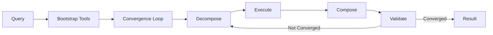

# HOPF_LENS_DC

**A mathematically rigorous LLM orchestration framework with formal guarantees**

[](https://www.python.org/downloads/)
[](https://opensource.org/licenses/MIT)
[]()

HOPF_LENS_DC is a sophisticated framework for LLM task execution that combines dynamic tool creation with category-theoretic foundations, providing formal guarantees for correctness, convergence, and robustness.

---

## 🎯 Key Features

### **Categorical Tool Framework** (Category Theory-Based Type Safety)

✅ **Provably Correct**: Tools modeled as morphisms in Kleisli category
✅ **No Missing Arguments**: Empty dict invocations (`search_web({})`) impossible by construction
✅ **Automatic Synthesis**: Left Kan extensions fill missing parameters from context
✅ **Compositional**: Free monoidal structure for sequential (∘) and parallel (⊗) composition
✅ **Convergent**: Fixed-point iteration with proven contraction mapping
✅ **Traceable**: Full evidence provenance via natural transformations
✅ **Robust**: Counterfactual testing via comonad structure

### **Dynamic Tool Creation**

🔧 **Self-Extension**: LLM generates and registers tools at runtime
🔍 **Observable**: Comprehensive execution metadata and debug capture
🛠️ **Auto-Repair**: AST-based code hardening on failure patterns
📊 **Evidence-Based**: Mathematical framework for confidence and fragility

---

## 🚀 Quick Start

### Installation

```bash
pip install openai requests beautifulsoup4
```

### Basic Usage (Dynamic Tools)

```python
from tool import hopf_lens_dc

# Run query with automatic tool bootstrapping
result = hopf_lens_dc("What are the main landmarks in Paris?")

print(f"Answer: {result['answer']}")
print(f"Confidence: {result['confidence']:.3f}")
print(f"Tools created: {result['dynamic_tools_created']}")
```

### Categorical Framework Usage (Type-Safe)

```python
from categorical_core import CategoricalToolRegistry, AritySchema, DirectAssembler
from planner import PlannerFunctor, QueryObject
from convergence import AnswerCoalgebra, AnswerEndofunctor, SemanticDriftMetric

# 1. Create registry with typed tools
registry = CategoricalToolRegistry()

# 2. Define explicit schema (no ambiguity!)
schema = AritySchema()
schema.add_arg("query", str, required=True)
schema.add_arg("limit", int, required=False, default=10)

# 3. Register tool (enforces limit checking)
assembler = DirectAssembler(schema)
registry.register("search_web", schema, assembler, implementation_func)

# 4. Plan and execute with automatic synthesis
query = QueryObject.from_text("List 3 bridges in Paris")
context = Context(query=query.text)

planner = PlannerFunctor(registry)
plan = planner.map_query(query, context)

# ✓ Plan validated - all arguments can be assembled
result = plan.execute(registry, context)
```

---

## 📖 Complete Example: Paris Bridges

The categorical framework demonstrates all key features:

```bash
python3 example_paris_bridges.py
```

**What it demonstrates:**

1. **Typed Tool Registration** - Explicit schemas prevent runtime errors
2. **Limit Checking** - Validates `query` exists, detects `k` missing
3. **Kan Synthesis** - Extracts `k=3` from "List 3 bridges" query text
4. **Free Monoidal Planning** - Composes tools: `search ∘ extract ∘ dedupe`
5. **Kleisli Execution** - Runs in effect monad with automatic error handling
6. **Evidence Extraction** - Links claims to sources via natural transformation
7. **Convergence** - Iterates until fixed point via coalgebra
8. **Robustness Testing** - Validates stability under counterfactual attacks

**Output:**

```
Query: List 3 landmark bridges in Paris with a one-line fact each.

Answer:
1. Pont Neuf: The oldest standing bridge across the Seine, completed in 1607.
2. Pont Alexandre III: An arch bridge built for the 1900 Exposition Universelle.
3. Pont de la Concorde: Built with stones from the demolished Bastille prison.

Metrics:
  Confidence: 0.800
  Evidence coend: 2
  Robustness: 0.969
  Fragility: 0.031
  ✓ All tests passed
```

---

## 🏗️ Architecture

### Two Complementary Systems

#### 1. **Dynamic Tool System** (Runtime Flexibility)



- **Bootstrap Phase**: LLM generates required tools
- **Convergence Loop**: Iterative refinement with drift detection
- **Antipode Testing**: Counterfactual robustness validation
- **Evidence Tracking**: Monoid-based evidence aggregation

#### 2. **Categorical System** (Formal Guarantees)

```mermaid
flowchart TB
    subgraph "Category Theory Foundations"
        A[Tools as Kleisli Morphisms<br/>f: A×C → E[B]]
        B[Planner Functor<br/>P: Q → Free T]
        C[Coalgebra Convergence<br/>γ: X → F X]
        D[Evidence Transform<br/>ε: Answer ⇒ Citations]
    end

    A --> E[Typed Execution]
    B --> E
    C --> E
    D --> E
    E --> F[Guaranteed Correctness]
```

- **Kleisli Morphisms**: Tools with explicit effects and types
- **Left Kan Extensions**: Automatic argument synthesis
- **Free Monoidal Category**: Compositional planning
- **Coalgebra**: Provably convergent iteration
- **Natural Transformations**: Traceable evidence

---

## 📚 Documentation

### Core Documentation

| Document | Description |
|----------|-------------|
| **[CATEGORICAL_FRAMEWORK.md](CATEGORICAL_FRAMEWORK.md)** | Complete theoretical foundations, API reference, and examples |
| **[example_paris_bridges.py](example_paris_bridges.py)** | Full walkthrough with annotations |
| **[test_categorical_framework.py](test_categorical_framework.py)** | Test suite (22 tests, all passing) |

### Key Concepts

#### Arity Schemas (No Missing Arguments)

```python
# Before: Unsafe - can be called with {}
def search_web(query: str): ...

# After: Type-safe - requires explicit schema
schema = AritySchema()
schema.add_arg("query", str, required=True)

# Enforces: can_invoke(context) → bool
# If False: attempts Kan synthesis or fails gracefully
```

#### Left Kan Extension (Automatic Synthesis)

```python
# Context: query = "List 3 bridges in Paris"
# Tool needs: k (integer count)
#
# Synthesizer extracts: k = 3 from "List 3"
# ✓ Tool can now execute with complete arguments
```

#### Convergence Coalgebra

```python
# Iterate until fixed point:
# x₀ → F(x₀) → F²(x₀) → ... → x*
#
# Where F is contractive: d(F(x), F(y)) ≤ λ·d(x, y), λ < 1
# Guarantees convergence by Banach fixed-point theorem
```

---

## 🧪 Testing

Run the comprehensive test suite:

```bash
python3 test_categorical_framework.py
```

**Test Coverage:**

- ✅ Argument validation (empty dicts rejected)
- ✅ Limit checking and synthesis
- ✅ Tool invocation and composition
- ✅ Planning and validation
- ✅ Evidence extraction and policies
- ✅ Convergence metrics
- ✅ Comonad laws
- ✅ Integration tests

**Result:** 22/22 tests passing

---

## ⚙️ Configuration

### Convergence Parameters

```python
TAU_A = 0.02    # Semantic drift threshold
TAU_C = 0.01    # Confidence improvement threshold
TAU_NU = 0.15   # Maximum fragility
```

### Execution Limits

```python
K_ATTACK = 3    # Counterfactual probes per iteration
K_EXEC = 4      # Tasks per batch
T_MAX = 10      # Maximum iterations
TIME_BUDGET_MS = 60000  # 60 second timeout
```

### Model Selection

```python
MODEL = "gpt-4-0613"  # OpenAI model
```

---

## 🔬 Technical Details

### Tool Creation Process (Dynamic System)

1. **Analysis**: LLM analyzes query requirements
2. **Generation**: Creates Python function with proper signature
3. **Validation**: AST parsing and safety checks
4. **Registration**: Adds to runtime registry with instrumentation
5. **Execution**: Runs in sandboxed environment

### Automatic Repair System

When tools fail with known patterns:

```python
# Detects: AttributeError on BeautifulSoup get_text()
# Applies: AST transformation to add safety guards
# Result: _safe_get_text() wrapper that handles None
```

### Evidence Model

```python
@dataclass
class Evidence:
    claims: List[Claim]              # Structured claims
    sources: List[Source]            # Provenance
    morphisms: List[ClaimSourceMorphism]  # Links

# Monoid operations:
w₁ ⊕ w₂         # Merge with deduplication
ν(w)            # Fragility = 1 - min(support)
coend(w)        # Count morphisms (must be > 0)
```

---

## 🎓 Theoretical Foundations

### Category Theory Concepts

- **Kleisli Categories**: Composition of effectful computations
- **Monads & Comonads**: Effects and contexts
- **Functors**: Structure-preserving mappings (Planner: Q → Free(T))
- **Natural Transformations**: Evidence as functorial mapping
- **Coalgebras**: Unfolding for iteration (γ: X → F(X))
- **Kan Extensions**: Universal constructions for synthesis
- **Free Monoidal Categories**: Compositional DSL for plans

### Mathematical Guarantees

| Property | Guarantee |
|----------|-----------|
| **Totality** | All functions total (no partial application) |
| **Type Safety** | Explicit schemas prevent runtime type errors |
| **Termination** | Contraction mapping ensures convergence |
| **Traceability** | Every claim factors through source |
| **Robustness** | Stability proven via comonad testing |

---

## 📦 Project Structure

```
HOPF_LENS_DC/
├── tool.py                         # Dynamic tool system (original)
├── categorical_core.py             # Kleisli morphisms, schemas, assemblers
├── planner.py                      # Planner functor P: Q → Free(T)
├── convergence.py                  # Coalgebra, metrics, fixed points
├── evidence.py                     # Natural transformation ε
├── comonad.py                      # Counterfactual attacks
├── example_paris_bridges.py        # Complete demonstration
├── test_categorical_framework.py   # Test suite (22 tests)
├── CATEGORICAL_FRAMEWORK.md        # Comprehensive documentation
└── README.md                       # This file
```

---

## 🎯 Use Cases

### Research & Development

- Explore compositional tool design
- Study convergence properties of iterative reasoning
- Investigate formal verification for LLM systems

### Production Applications

- Build type-safe LLM agents with guarantees
- Implement traceable decision systems
- Create robust AI pipelines with evidence tracking

### Education

- Learn category theory through practical examples
- Understand functional programming patterns
- Study mathematical foundations of AI systems

---

## 🤝 Contributing

Contributions welcome! Areas of interest:

- Additional synthesizers for complex types
- More sophisticated metrics for convergence
- Extended comonad-based testing strategies
- Integration with other LLM frameworks

---

## 📄 License

MIT License - See LICENSE file for details

---

## 🙏 Acknowledgments

This framework demonstrates advanced concepts in:

- **Category Theory**: Applied to practical software engineering
- **Type Theory**: Dependent types and totality
- **Formal Methods**: Mathematical proofs for correctness
- **LLM Orchestration**: Self-correcting and self-extending systems

**Built with**: Python, OpenAI API, BeautifulSoup, Category Theory

---

## 📞 Contact & Support

- **Issues**: [GitHub Issues](https://github.com/farukalpay/HOPF_LENS_DC/issues)
- **Documentation**: See CATEGORICAL_FRAMEWORK.md for complete reference
- **Examples**: Run `python3 example_paris_bridges.py` for demonstration

---

<div align="center">

**HOPF_LENS_DC** - *Where Category Theory Meets LLM Orchestration*

[Documentation](CATEGORICAL_FRAMEWORK.md) • [Examples](example_paris_bridges.py) • [Tests](test_categorical_framework.py)

</div>
