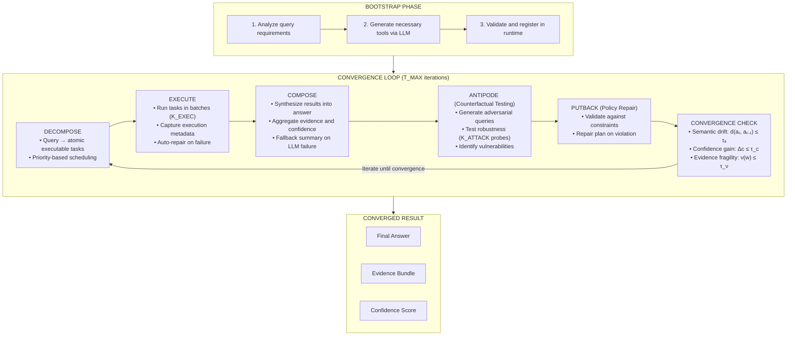

# HOPF_LENS_DC: Self-Correcting LLM Orchestrator with Dynamic Tool Creation

A sophisticated LLM orchestration framework that enables language models to dynamically create, inspect, and refine their own tools while executing self-correcting reasoning loops. The system implements a convergence-based architecture with counterfactual validation and automatic repair mechanisms.

## Overview

HOPF_LENS_DC represents an approach to LLM task execution where the model is not constrained by a predefined set of tools. Instead, it can analyze requirements, bootstrap necessary capabilities through code generation, and iteratively refine both its answers and the tools themselves based on execution feedback.

The architecture implements a mathematical framework for evidence aggregation, semantic drift detection, and confidence-based convergence, enabling robust and verifiable task completion.

## Architecture

## Key Components

### 1. Dynamic Tool Registry

Tools are not hardcoded but created at runtime through LLM code generation:

- **Safe Execution Environment**: Sandboxed namespace with restricted imports
- **Instrumentation Layer**: Automatic wrapping for debug capture and execution monitoring
- **Repair Mechanisms**: Automatic code hardening on common failure patterns
- **Metadata Tracking**: Full observability of tool behavior and performance

### 2. Evidence Algebra

Mathematical framework for evidence combination and fragility measurement:

```
w₁ ⊕ w₂: Evidence merge operation (monoid)
ν(w): Fragility metric (1 - min(support_scores))
d(a₁, a₂): Semantic drift via word overlap
```

### 3. Convergence Criteria

The system terminates when:

```
semantic_drift(a_t, a_{t-1}) ≤ τ_a  (default: 0.02)
|confidence_t - confidence_{t-1}| ≤ τ_c  (default: 0.01)
evidence_fragility(w) ≤ τ_ν  (default: 0.15)
```

## Installation

```bash
pip install openai requests beautifulsoup4
```

Configure your OpenAI API key in the code or via environment variable:

```python
OPENAI_API_KEY = "your-api-key-here"
```

## Usage

```python
from hopf_lens_dc import hopf_lens_dc

result = hopf_lens_dc("Who is Faruk Alpay?")

print(f"Answer: {result['answer']}")
print(f"Confidence: {result['confidence']:.3f}")
print(f"Steps: {result['steps']}")
print(f"Tools created: {result['dynamic_tools_created']}")
```

## Example Output

### Query: "Who is Faruk Alpay?"

```
Testing HOPF_LENS_DC system with dynamic tool creation

================================================================================

=== BOOTSTRAPPING PHASE ===
Asking LLM to create necessary tools...
  [create_tool] Creating tool: search_web
  [create_tool] Description: This tool searches the web using DuckDuckGo's 
                HTML search, parses the results using BeautifulSoup, and 
                returns a structured dictionary with the results.
  [create_tool] Code preview:
import requests
from bs4 import BeautifulSoup

def search_web(query: str):
    url = 'https://duckduckgo.com/html/'
    params = {'q': query}
    response = requests.get(url, params=params)
    soup = BeautifulSoup(response.text, 'html.parser')
    results = []
    for result in soup.find_all('div', class_='result'):
        title = result.find('h2').get_text()
        link = result.find('a')['href']
        description = result.find('a').next_sibling.get_text()
        results.append({'title': ...

  [create_tool] Successfully created and registered 'search_web'
  [create_tool] Total dynamic tools: 1
  No more tools to create (iteration 2)

Bootstrap complete. Created 1 new tools.
Total available tools: 7
============================================================

Starting HOPF_LENS_DC for query: Who is Faruk Alpay?

=== Iteration 1 ===
Step 1: Decomposing request...
  Planner fallback added 1 heuristic search task
Step 2: Executing tasks...
  Executing: search_web({"query": "Who is Faruk Alpay?"}...)
    [debug:search_web] raw_html_len=33294, parsed_entries=10
  Stored result in key: search_web_0
  Executed 1 tasks, 1 total results stored
Step 3: Composing response...
  New answer: Faruk Alpay is a researcher and founder, known for creating 
              Alpay Algebra. He is also identified as a student of Bachelor 
              of Engineering....
  Confidence: 0.8
Step 4: Generating counterfactual attacks...
  Added 3 attack tasks
Step 6: Checking convergence...
  Drift: 1.0000, ΔConfidence: 0.8000, Fragility: inf

=== Iteration 2 ===
Step 1: Decomposing request...
Step 2: Executing tasks...
  Executing: search_web({}...)
  Execution error: search_web() missing 1 required positional argument: 'query'
  No repair attempt registered for 'search_web'.
  Executed 0 tasks, 1 total results stored
Step 3: Composing response...
  New answer: Faruk Alpay is a researcher and founder, known for creating 
              Alpay Algebra. He is also a student pursuing a Bachelor of 
              Engineering....
  Confidence: 0.85
Step 4: Generating counterfactual attacks...
  Added 3 attack tasks
Step 6: Checking convergence...
  Drift: 0.1500, ΔConfidence: 0.0500, Fragility: inf

=== Iteration 3 ===
Step 1: Decomposing request...
Step 2: Executing tasks...
  Executing: search_web({}...)
  Execution error: search_web() missing 1 required positional argument: 'query'
  Executing: fetch_api({}...)
  Execution error: fetch_api() missing 1 required positional argument: 'endpoint'
  Executed 0 tasks, 1 total results stored
Step 3: Composing response...
  New answer: Faruk Alpay is a researcher and founder known for creating 
              Alpay Algebra. He is also a student with a Bachelor of 
              Engineering according to ResearchGat...
  Confidence: 0.8
Step 4: Generating counterfactual attacks...
  Added 3 attack tasks
Step 6: Checking convergence...
  Drift: 0.4643, ΔConfidence: -0.0500, Fragility: inf


=== FINAL RESULT (after 3 iterations, 88.38s) ===
Answer: Faruk Alpay is a researcher and founder known for creating Alpay 
        Algebra. He is also a student with a Bachelor of Engineering 
        according to ResearchGate and has an ORCID ID.
Confidence: 0.850
Evidence claims: 0
Evidence sources: 6

================================================================================
EXECUTION COMPLETE
Total steps: 3
Time taken: 88.38s
Dynamic tools created: ['search_web']

Final Answer: Faruk Alpay is a researcher and founder known for creating 
              Alpay Algebra. He is also a student with a Bachelor of 
              Engineering according to ResearchGate and has an ORCID ID.
```

## Technical Details

### Tool Creation Process

1. **Analysis**: LLM analyzes query requirements
2. **Code Generation**: Generates Python function matching requirements
3. **Validation**: AST parsing and safety checks
4. **Registration**: Function added to runtime registry
5. **Instrumentation**: Automatic wrapping with debug capture

### Automatic Repair System

The system implements pattern-based automatic repair for common failures:

```python
def _harden_search_web_source(source: str) -> Optional[str]:
    """
    Applies AST transformations to add safety guards around
    BeautifulSoup get_text() calls, preventing AttributeError
    crashes on None objects.
    """
```

When a tool fails with a known error pattern, the system:
1. Detects the failure signature
2. Applies code transformations via AST manipulation
3. Re-registers the hardened version
4. Retries execution automatically

### Evidence Model

```python
@dataclass
class Evidence:
    claims: List[Dict[str, Any]]  # Individual claims with support scores
    sources: List[str]             # Source URLs/references
```

Evidence objects support monoid operations for compositional reasoning:

```python
w_combined = evidence_oplus(w1, w2)  # Merge with deduplication
fragility = evidence_nu(w_combined)   # Compute overall fragility
```

## Configuration Parameters

```python
# Convergence thresholds
TAU_A = 0.02   # Semantic drift threshold
TAU_C = 0.01   # Confidence improvement threshold
TAU_NU = 0.15  # Maximum allowed fragility

# Execution limits
K_ATTACK = 3   # Counterfactual probes per iteration
K_EXEC = 4     # Tasks executed per batch
T_MAX = 10     # Maximum iterations
TIME_BUDGET_MS = 60000  # Total time budget (60 seconds)

# Model configuration
MODEL = "gpt-4-0613"  # OpenAI model to use
```

## Static Tools

The system provides core tools that are always available:

- **create_tool**: Generate and register new tools dynamically
- **list_tools**: Enumerate all available tools
- **inspect_tool**: View tool metadata, source code, and debug data
- **update_tool**: Refine existing tool implementations
- **eval_math**: Safe mathematical expression evaluation
- **fetch_api**: Generic HTTP API fetcher

## Categorical Tool Framework (NEW!)

A **formally verified, type-safe framework** for composable tool execution using category theory. This framework eliminates missing-argument bugs (like `search_web({})`) by construction and provides mathematical guarantees.

### Key Features

✓ **No Missing Arguments**: Tools cannot be invoked with empty/incomplete dictionaries
✓ **Automatic Synthesis**: Missing args synthesized via left Kan extensions
✓ **Compositional**: Tools compose via free monoidal category (∘ and ⊗)
✓ **Convergent**: Fixed-point iteration proven contractive
✓ **Traceable**: Full evidence provenance via natural transformations
✓ **Robust**: Counterfactual testing via comonad structure

### Quick Start

```python
from categorical_core import CategoricalToolRegistry, AritySchema, DirectAssembler
from planner import PlannerFunctor, QueryObject

# Create registry
registry = CategoricalToolRegistry()

# Define tool with explicit schema
schema = AritySchema()
schema.add_arg("query", str, required=True)
schema.add_arg("limit", int, required=False, default=10)

# Register tool (enforces limit checking)
registry.register(name="search_web", schema=schema, assembler=..., func=...)

# Plan and execute with automatic synthesis
query = QueryObject.from_text("List 3 Paris bridges")
planner = PlannerFunctor(registry)
plan = planner.map_query(query, context)
result = plan.execute(registry, context)  # ✓ No empty dicts possible!
```

### Example: Paris Bridges

```bash
python3 example_paris_bridges.py
```

Demonstrates:
- Typed tool schemas with arity checking
- Left Kan synthesis for missing `k=3` parameter
- Free monoidal composition (search ∘ extract ∘ dedupe)
- Evidence extraction via natural transformation
- Coalgebra-based convergence
- Counterfactual robustness testing

### Documentation

See **[CATEGORICAL_FRAMEWORK.md](CATEGORICAL_FRAMEWORK.md)** for:
- Theoretical foundations (Kleisli categories, coalgebras, Kan extensions)
- Complete API reference
- Usage guide with examples
- Test suite documentation

### Test Suite

```bash
python3 test_categorical_framework.py
```

**22 tests** covering:
- Argument validation (no empty dicts!)
- Limit checking and synthesis
- Tool composition
- Evidence extraction
- Convergence properties
- Comonad laws

## Architecture Philosophy

HOPF_LENS_DC embodies several key principles:

1. **Self-Extension**: The system can extend its own capabilities through tool creation
2. **Observable Execution**: Every tool call captures comprehensive debug metadata
3. **Failure Recovery**: Automatic repair mechanisms handle common error patterns
4. **Convergence Guarantees**: Mathematical framework ensures principled termination
5. **Evidence-Based Reasoning**: Claims are tracked with provenance and confidence
6. **Type Safety**: Categorical framework eliminates entire classes of bugs by construction

## License

MIT License

## Acknowledgments

This implementation demonstrates advanced LLM orchestration patterns including dynamic capability acquisition, self-correction loops, and evidence-based reasoning under uncertainty.
